```{r setup, include=FALSE}
knitr::opts_chunk$set(echo = TRUE, warning=FALSE, message = FALSE)
```

## Background

Experienced GIS Analyst and Geospatial Data Specialist with expertise in spatial analysis, mapping, and data automation to 
support environmental planning, green infrastructure projects, and scientific research. Proficient in ArcGIS, QGIS, Python, R, 
and SQL, with a strong background in ecological analysis, spatial modeling, and geospatial data visualization. Skilled in 
managing GIS databases, optimizing workflows, and integrating geospatial insights into project planning and 
decision-making. Can engage stakeholders in non-technical explanations of complex processes.


## Samples of work

#### R notebook simple coding

Refining a species distribution model to only those areas that are above the minimum observed value, and below the maximum observed value.
[Sample R notebook](https://github.com/GalantePeter/WorkingCode/blob/master/dataDriven.R)

#### Urban conservation

**3 coyotes in New York City were collared with GPS receivers. Habitat assessments (unsurprisingly) determined that they spend the vast majority of their time in green space. Machine-learning models were able to predict their locations with >85% accuracy.**

| Southernmost breeding population in NYS | Largely utilizing green space | 
|:-----:|:-----:|
| 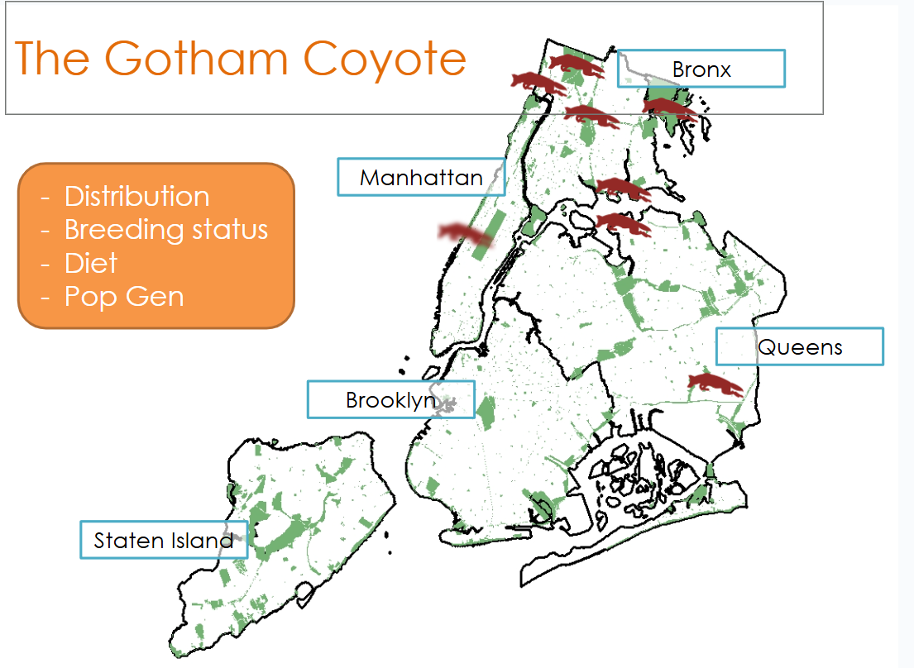{width=300px} | 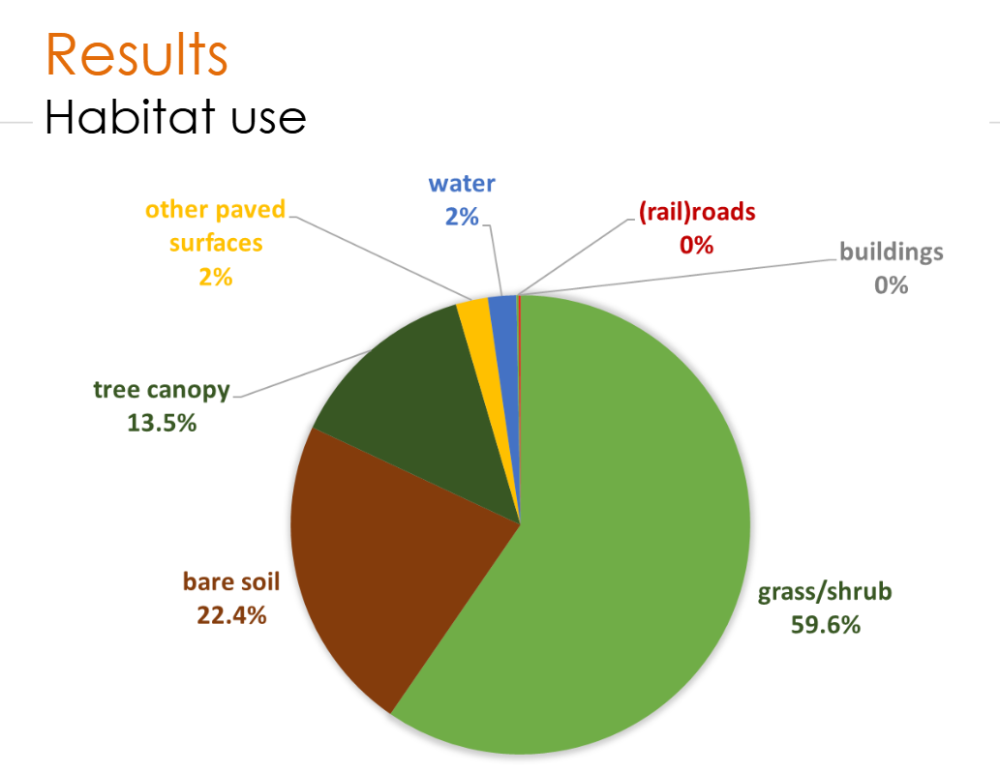{width=300px} | 

<br>
<br>

## Relevant publications
<center>
#### Data visualization: Range maps, habitat use, and implications for conservation
</center>
<br> 

| **A comparison of Maxent's default settings with two optimal model selection techniques for a species with few known localities, in both high and low sampling bias environments.**  | **Finding that karst topography is an apparent abiotic driver of François’ langur distribution projected into multiple climate scenarios.** |
|:------------:|:------------:|
| [Galante, P. J., Alade, B., Muscarella, R., Jansa, S. A., Goodman, S. M., & Anderson, R. P. (2018). The challenge of modeling niches and distributions for data‐poor species: a comprehensive approach to model complexity. Ecography, 41(5), 726-736.](pdf/10379108.pdf) | [Blair, M. E., Nguyen, T. A., Le, M. D., Liu, Z., Meng, T., Horning, N., ... & Galante, P. J. (2022). Karst as an abiotic driver of François’ langur distribution, with predictions for biological communities on karst under climate change. Frontiers of Biogeography, 14(1).](pdf/qt3f46r01b.pdf) |
| 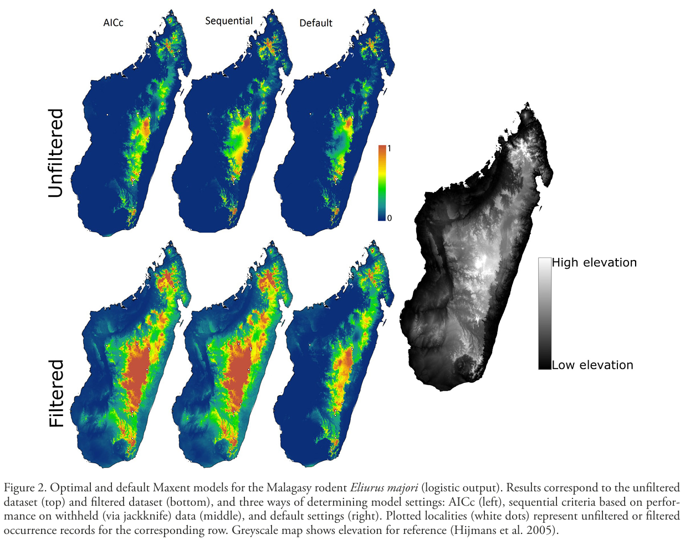{width=300px} | 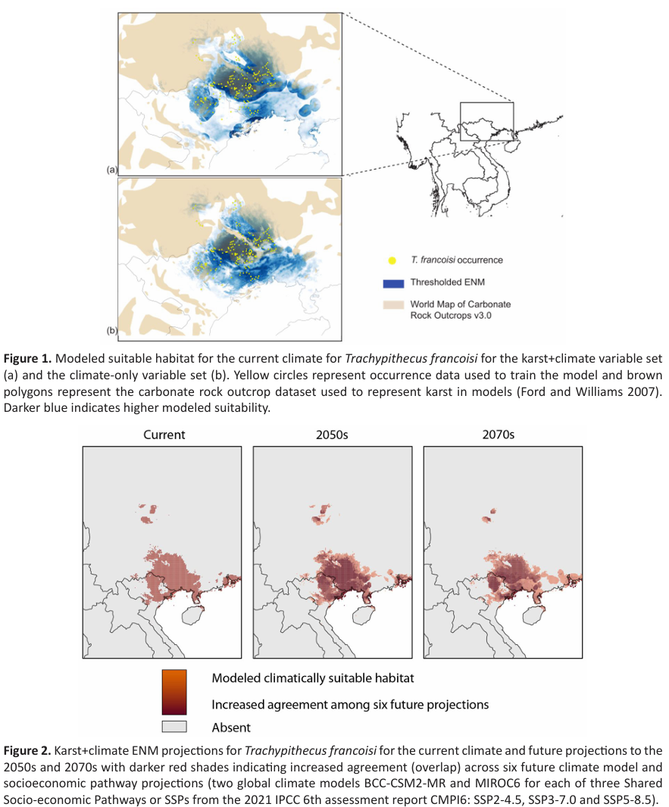{width=300px} |

<br>

| **Projecting distribution models created from modern occurrence localities into the past to examine how the isthmus of Panama may have led to speciation among Central American bird species.** | **Home range utilization of resident green turtles in a Marine Protected Area.** |
|:-------------------------:|:-----------------------:|
| [Musher, L. J., Galante, P. J., Thom, G., Huntley, J. W., & Blair, M. E. (2020). Shifting ecosystem connectivity during the Pleistocene drove diversification and gene‐flow in a species complex of Neotropical birds (Tityridae: Pachyramphus). Journal of Biogeography, 47(8), 1714-1726.](pdf/jbi.13862.pdf) | [Naro-Maciel, E., Arengo, F., Galante, P., Vintinner, E., Holmes, K. E., Balazs, G., & Sterling, E. J. (2018). Marine protected areas and migratory species: residency of green turtles at Palmyra Atoll, Central Pacific. Endangered Species Research, 37, 165-182.](pdf/n037p165 (1).pdf) |
| 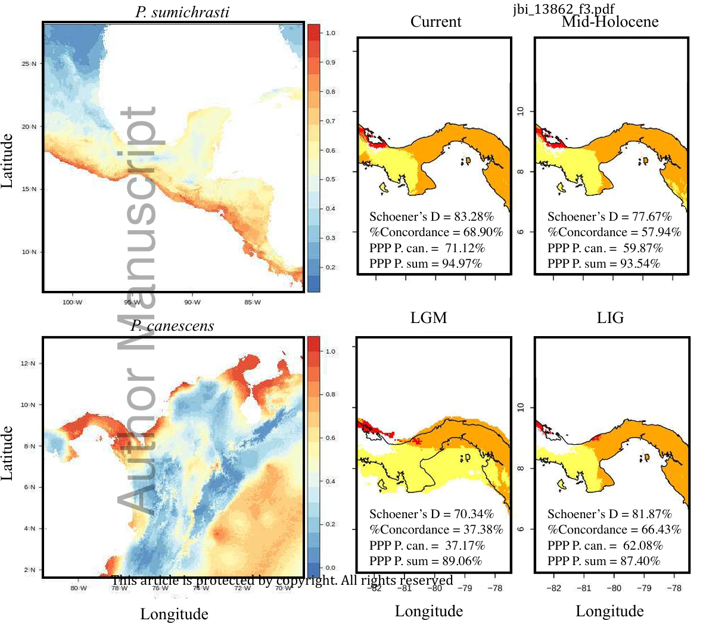{width=300px} | 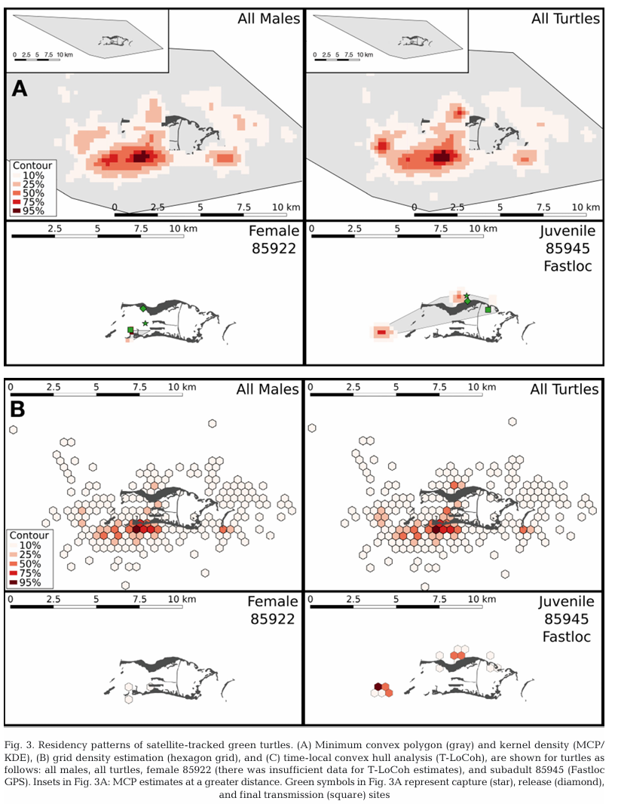{width=300px} |

<br>

## Published software notes
### Open-source software for collaborative and conservation efforts, making reproducible range maps easier
| **ENMeval: An R package for automated Maxent model tuning across a range of settings with options for reducing sampling bias and data-partitioning.** | **Wallace 2: A graphical user interface with an updated version of wallace with faster processing, 9 new modules, and added functionalities for data acquisition, metadata tracking, and citations.** |
|:-------------------------:|:-----------------------:|
| [Muscarella, R., Galante, P. J., Soley‐Guardia, M., Boria, R. A., Kass, J. M., Uriarte, M., & Anderson, R. P. (2014). ENM eval: An R package for conducting spatially independent evaluations and estimating optimal model complexity for Maxent ecological niche models. Methods in ecology and evolution, 5(11), 1198-1205.](pdf/Methods Ecol Evol - 2014 - Muscarella - ENMeval  An R package for conducting spatially independent evaluations and.pdf) | [Kass, J. M., Pinilla‐Buitrago, G. E., Paz, A., Johnson, B. A., Grisales‐Betancur, V., Meenan, S. I., ... & Anderson, R. P. (2023). wallace 2: a shiny app for modeling species niches and distributions redesigned to facilitate expansion via module contributions. Ecography, 2023(3), e06547.](pdf/Ecography - 2023 - Kass - wallace 2  a shiny app for modeling species niches and distributions redesigned to facilitate.pdf) | 
| 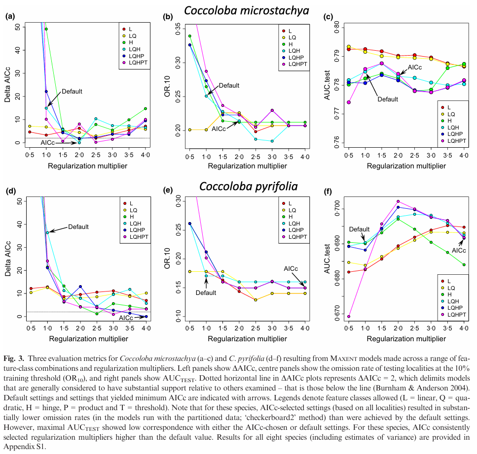{width=300px} | 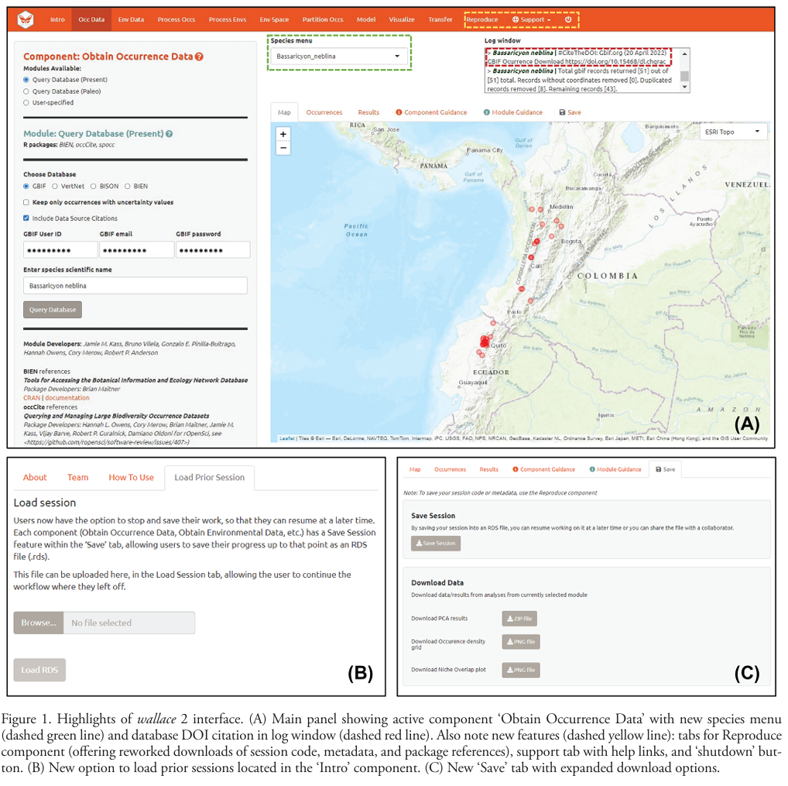{width=300px} |

<br>

| **maskRangeR: Incorporating expert knowledge with models of species' distributions can increase accuracy of range estimates.** | **ENMeval version 2: with user-suggested improvements with faster model evaluations with an R-native maxent algorithm.** |
|:-------------------------:|:-----------------------:|
| [Merow, C., Galante, P. J., Kass, J. M., Aiello-Lammens, M. E., Babich Morrow, C., Gerstner, B. E., ... & Blair, M. E. (2022). Operationalizing expert knowledge in species' range estimates using diverse data types. Frontiers of Biogeography, 14(2).](pdf/qt3m7719vv_noSplash_0a4a1904b555da526e53a78bf5139209.pdf) | [Kass, J. M., Muscarella, R., Galante, P. J., Bohl, C. L., Pinilla‐Buitrago, G. E., Boria, R. A., ... & Anderson, R. P. (2021). ENMeval 2.0: Redesigned for customizable and reproducible modeling of species’ niches and distributions. Methods in Ecology and Evolution, 12(9), 1602-1608.](pdf/Methods Ecol Evol - 2021 - Kass - ENMeval 2 0  Redesigned for customizable and reproducible modeling of species  niches and.pdf) | 
| 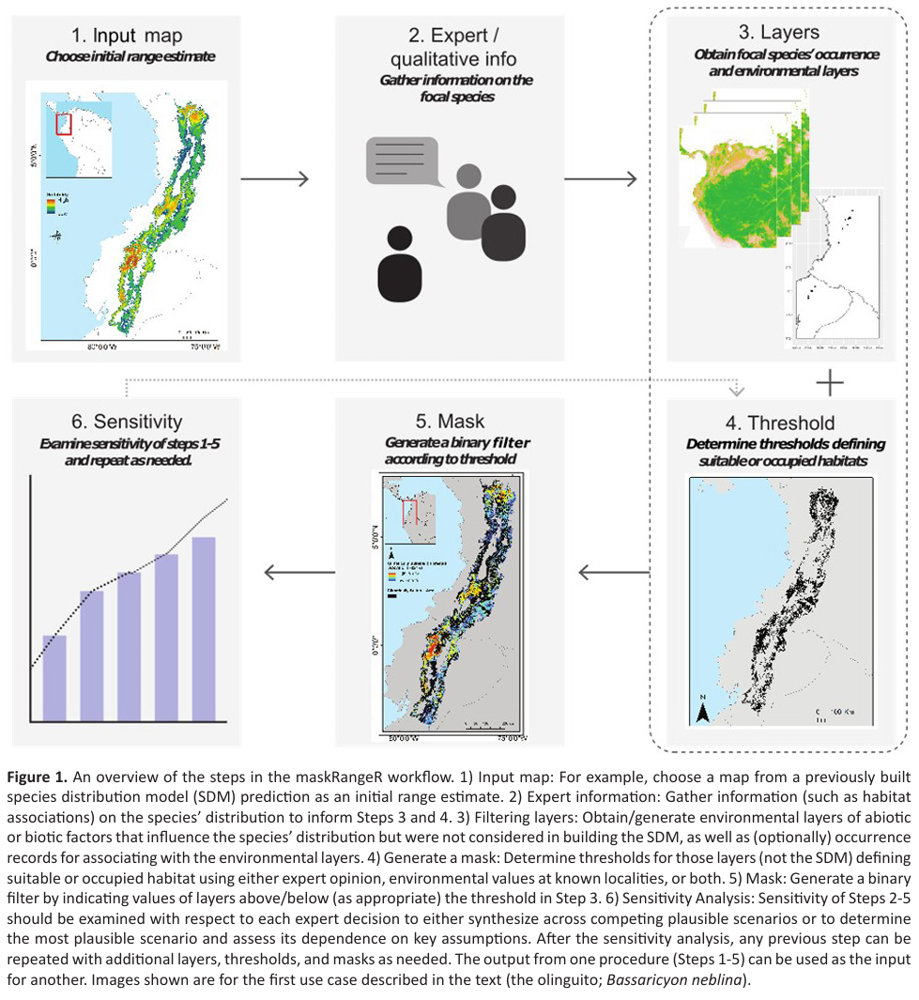{width=300px} | 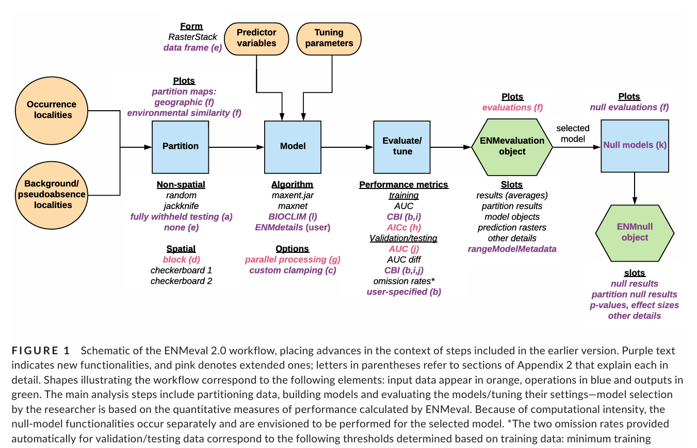{width=300px} | 

<br>

| **changeRangeR: Reproducibly transform estimates of species' distributions into metrics relevant for conservation.** | |
|:--:|:--:|
| [Galante, P. J., Chang Triguero, S., Paz, A., Aiello‐Lammens, M., Gerstner, B. E., Johnson, B. A., ... & Blair, M. E. (2023). changeRangeR: An R package for reproducible biodiversity change metrics from species distribution estimates. Conservation Science and Practice, 5(1), e12863.](pdf/Conservat Sci and Prac - 2022 - Galante - changeRangeR  An R package for reproducible biodiversity change metrics from.pdf)|  |
| 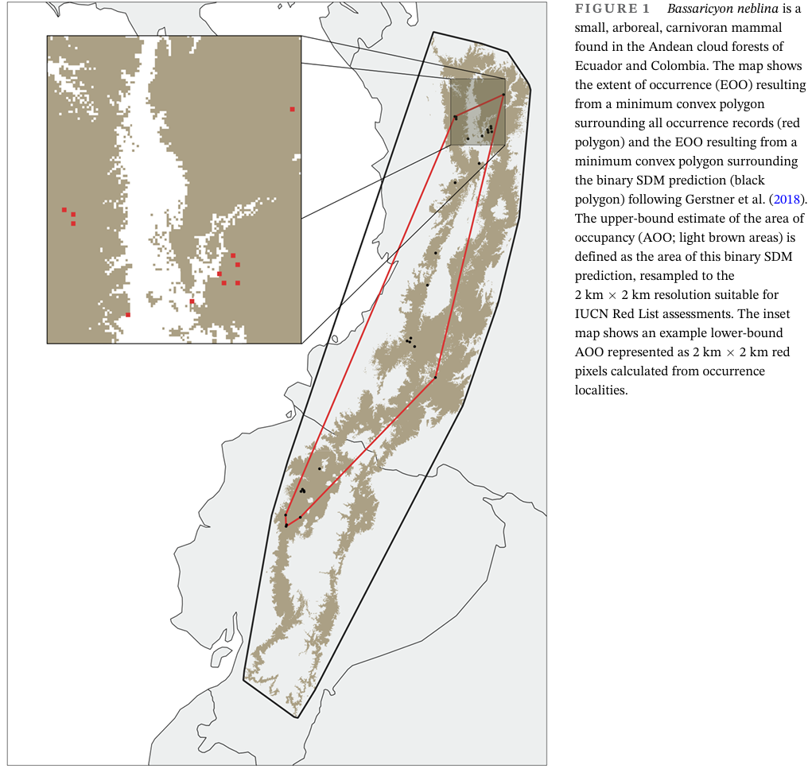{width=300px} |  |

<br>
<br>


### Course examples

[Example of a semester-length open-source GIS course for graduate students in Biology](https://pgalante.github.io/openGIS/)